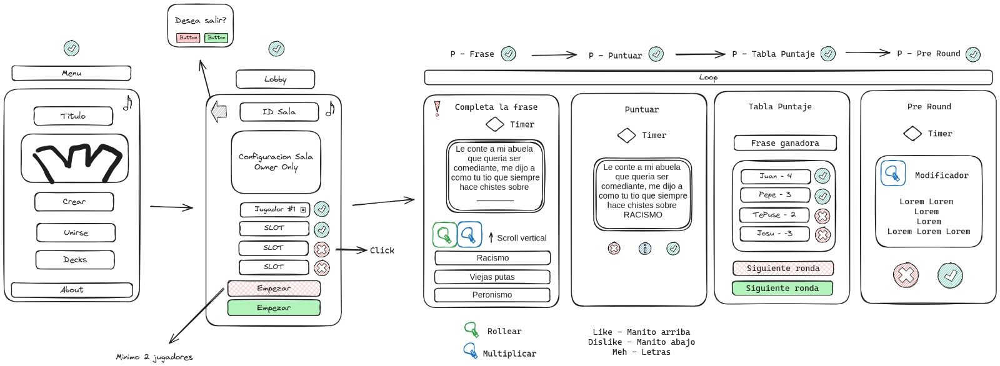

# One More Chance 🤚

Base idea



Logo


## Description 📝

Based on the H.D.P game (Hasta donde puedas) omc is a boardgame made in the browser, with multiplayer support and mobile first.

## Stack 🛠

- Sveltekit
- Typescript
- Daisyui
- Tailwindcss
- Websockets
- AWS
- Docker
- Github Actions
- Ansible
- Terraform

## Folder Structure 📁

```
🌳 onemorechance/
┣ 📁 .github/ -- Actions
┣ 📁 app/ -- The app itself
┃ ┣ 📁 src/
┃ ┃ ┣ 📁 lib/
┃ ┃ ┣ 📁 params/
┃ ┃ ┣ 📁 routes/
┣ 📁 docs/
┣ 📁 infra/ -- Infrastructure as code
┣ 📔 LICENSE
┣ 📔 README.md
┣ 📔 Makefile - Shortcut linux commands

```
## License 📜

Check the [LICENSE](LICENSE) file for license rights and limitations (MIT).